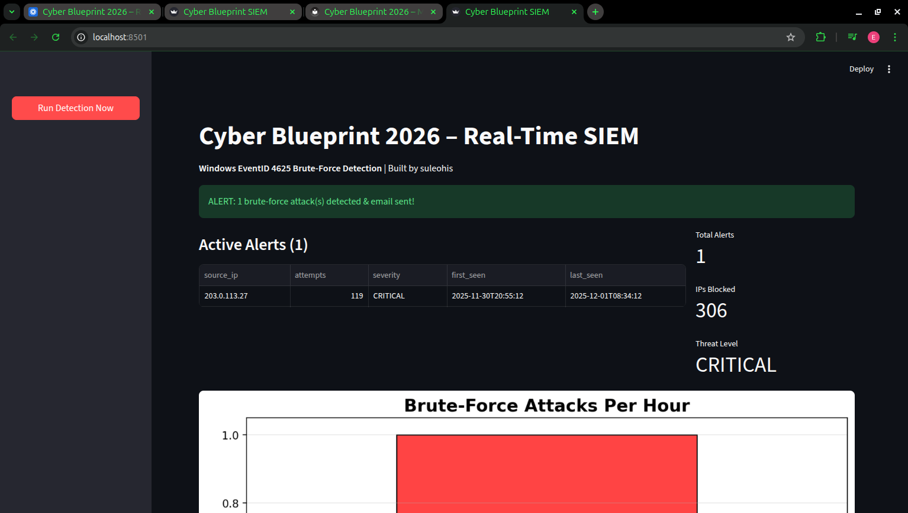

# Cyber Blueprint 2026 – Real-Time Mini-SIEM


**30-day journey from zero to production-grade SOC tooling**  
**Live Site → https://suleohis.github.io/cyber-blueprint-2026**  
**One-click demo → `./start_soc.sh`**

### Features
- Real-time Windows EventID 4625 brute-force detection
- Streamlit + Matplotlib live dashboard with attack timeline
- Auto-email alerts via Gmail
- Automatic IP blocking
- Professional documentation site (MkDocs + Material)

### Quick Start
```bash
git clone https://github.com/suleohis/cyber-blueprint-2026.git
cd cyber-blueprint-2026
./start_soc.sh          # ← generates attacks + launches dashboard
# Open http://localhost:8501

Live Site → https://suleohis.github.io/cyber-blueprint-2026 

[](https://www.loom.com/share/623b439befed419fb347f7a8e04fe22e)