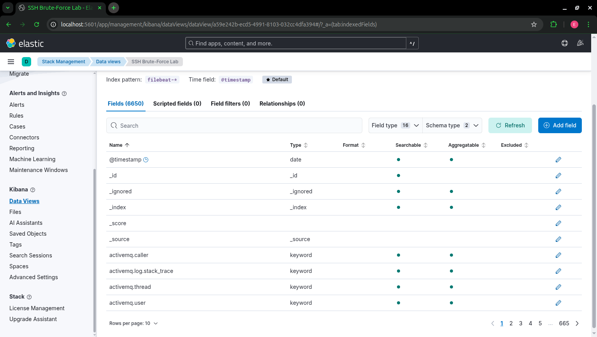

# Day 1 – I Saw My First Real SSH Brute-Force Logs in Kibana!
**Date:** 2025-12-01  
**What I learned today (simple words):**
- Docker runs Elasticsearch + Kibana + Filebeat together
- Filebeat watches my real SSH log file
- I generated 40 failed logins and they appeared live in Kibana
- I can search with "message : Failed password"

**Result:**

**Day 1 → CLOSED – I DID IT!**
